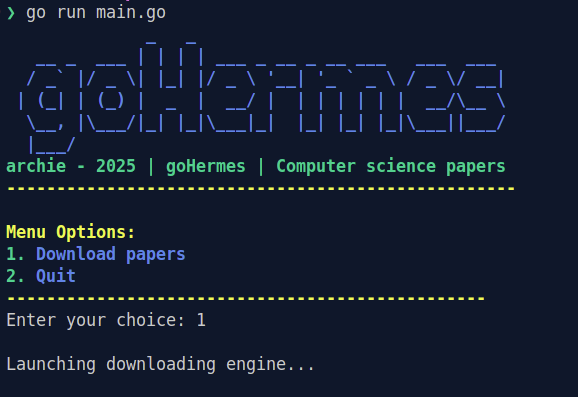

# goHermes

GoHermes is a golang written script that scraps scientific documents from several sources. It builds a library for several purposes like learning, AI training, collection, etc.
This tool provides fast document downloading, using Go concurrency, data storage into a Sqlite DB, and a logging system to track downloading errors, like typically withdrawn paper.

# Features

goHermes can currently download pdf from the following sources :
- ePrint : https://eprint.iacr.org/complete/
- free haven : https://www.freehaven.net/anonbib/date.html

In-coming : a manual discribing the scrapping behaviour for each sources.

# Preview



# Tutorial

1- Download the git repository
```bash
git clone https://github.com/Bl4omArchie/goHermes
cd goHermes
```

2- Launch the script
```bash
go run main.go
```

Once on the main menu, press 1 to download automatically every pdf from every sources.