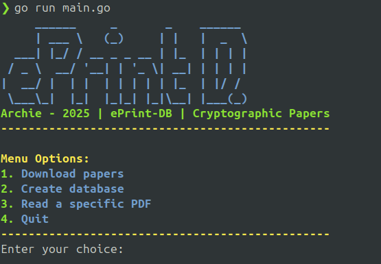

# ePrint D.

This tool is a golang script that download papers from the website ePrint.
It stores every PDF into a folder and fill a database with metadata.
The point of this project is to create a datalake for AI training and experimentation.

Current supported sources :
- ePrint

In-coming sources :
- arxiv
- NIST
- HAL

